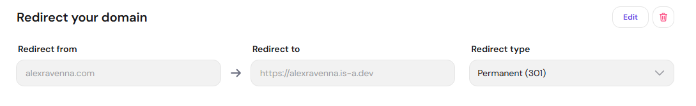
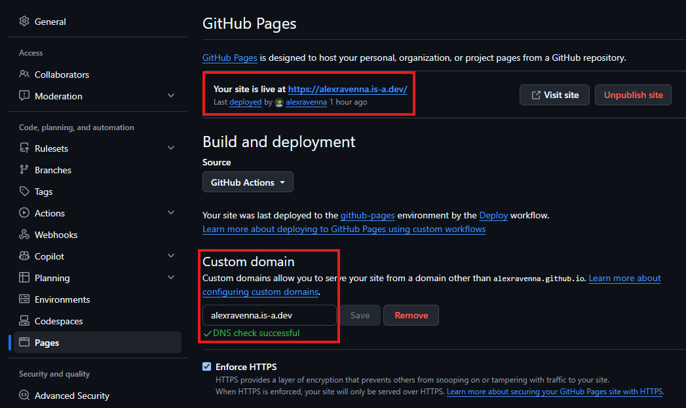
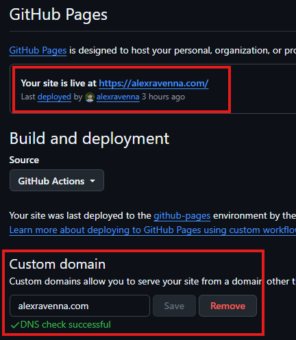
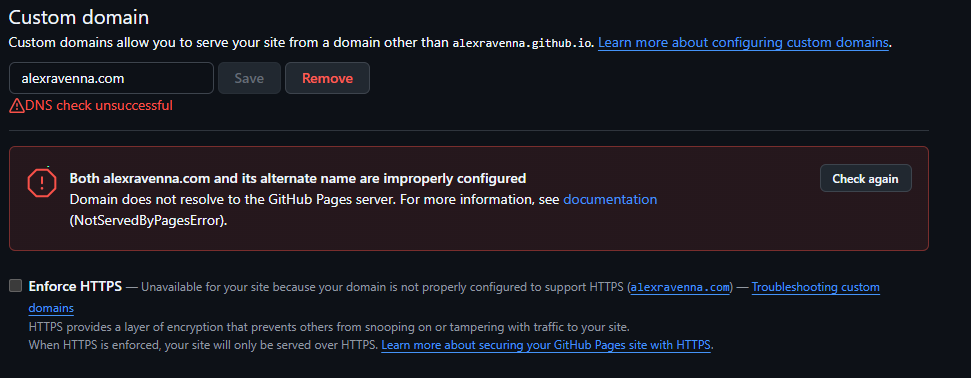
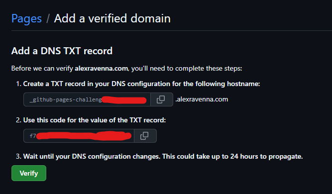
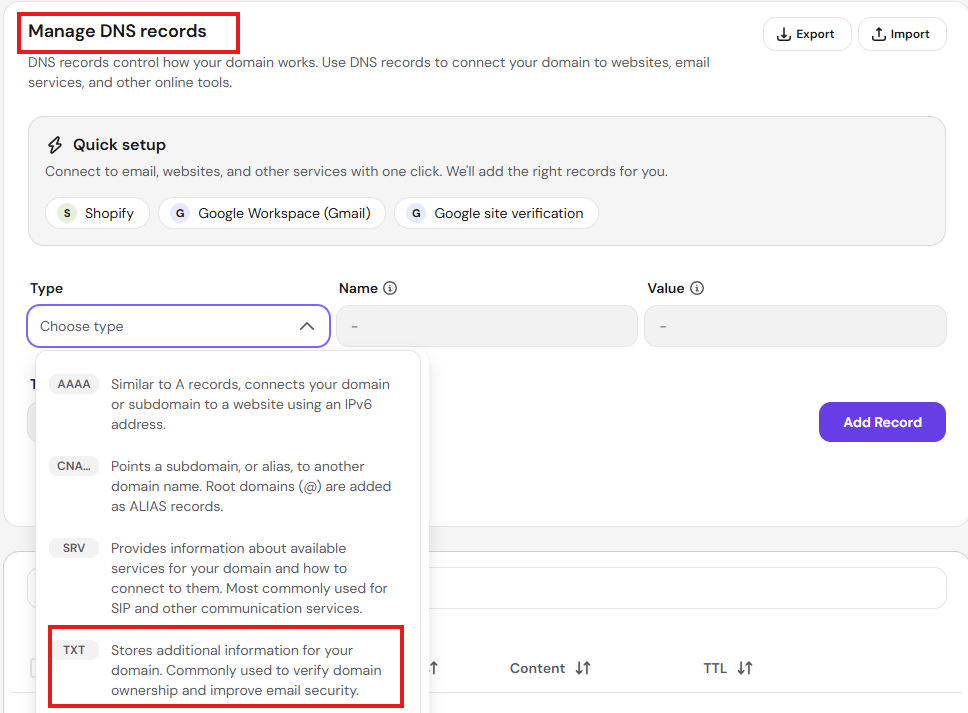
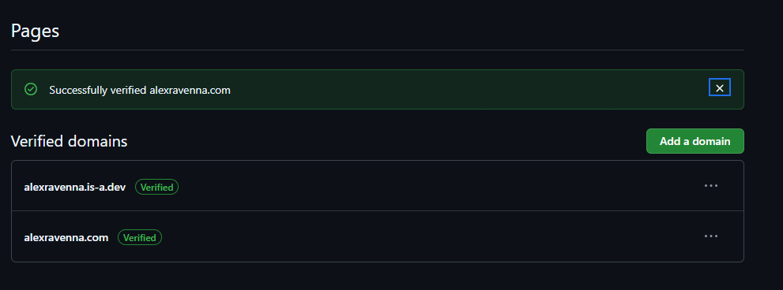
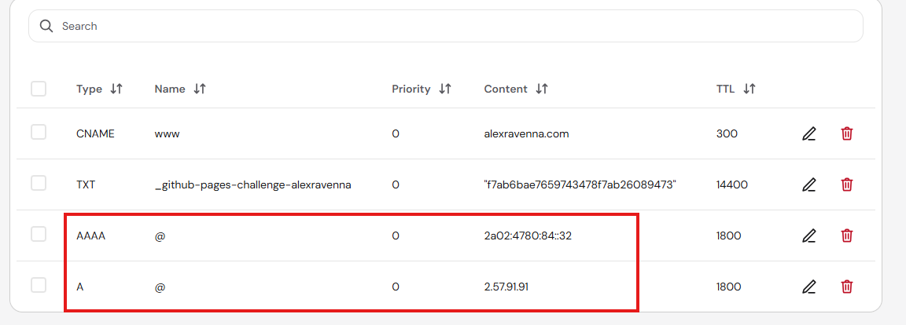
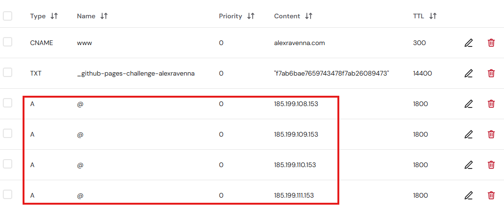
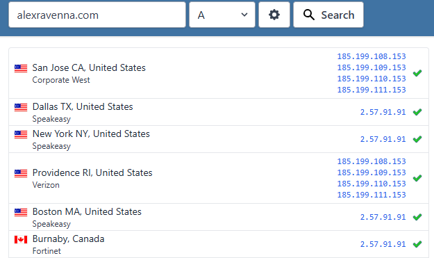

## Introduction

I recently decided to switch to `alexravenna.com` as the canonical domain for my website.

I already bought the domain a long time ago (woohoo!), but for some reason had originally decided to have `alexravenna.is-a.dev` be the default domain for this site and have every other domain redirect to that.

## Terminology

First, let's take a quick refresher on the terms behind a URL like https://alexravenna.github.io to avoid confusion later:

|URL Section|Term|
|-|-|
|https|scheme|
|alexravenna|subdomain label|
|alexravenna.github.io|subdomain|
|github.io|apex domain|
|io|top-level domain (TLD)|

## GitHub Pages Default Domain Name

This website is hosted on [GitHub Pages](https://docs.github.com/en/pages), which automatically gives it the domain [alexravenna.github.io](https://alexravenna.github.io). That domain comes from my GitHub username, "alexravenna".

As described in [the documentation](https://docs.github.com/en/pages/getting-started-with-github-pages/what-is-github-pages#types-of-github-pages-sites), the code for a website hosted on GitHub Pages has to be located in a repository of the name

```
<GITHUB-USERNAME>.github.io
```

for example: [alexravenna.github.io](https://github.com/alexravenna/alexravenna.github.io) (click to be taken to the repository). You can only create one such GitHub Pages website per GitHub username.

I thought that `alexravenna.github.io` was too boring, so I decided I'd rather use a custom domain!

## Custom .is-a.dev Subdomain

I stumbled upon the [is-a.dev project](https://is-a.dev) at some point, which allows anyone to create a custom subdomain under the "is-a.dev" apex domain for free. Since I'm a software **dev**eloper, that appealed to me!

That means that if you follow the [registration process for GitHub Pages ](https://docs.is-a.dev/guides/github-pages/) - maybe I'll make a post about that someday, since it was more complicated than I expected - you receive a free domain at 

```
<GITHUB-USERNAME>.is-a.dev
```

However, in order to make `alexravenna.is-a.dev` be the final destination for `alexravenna.com` too, it was necessary to configure a redirect:

```
alexravenna.com -> alexravenna.is-a.dev
```

## Original Redirect

Here's the original redirect configured in my domain provider:



If this were still active, this would mean that inputting "alexravenna.com" into your browser would always automatically take you to "https://alexravenna.is-a.dev" without you having to do anything.

## Migrating Domains

When this post goes live, you should always be redirected to this final URL

```
http://alexravenna.com/posts/migrate-github-pages-domain
```

and not to

```
http://alexravenna.is-a.dev/posts/migrate-github-pages-domain
```

How did I achieve that?

1. First, I removed the redirect configuration from my domain provider (see the screenshot above). They informed me:

However, the removal of the redirect seemed to happen basically immediately. After that `alexravenna.com` loaded a default "Parked domain name" page from my domain provider.

2. Next, I updated the GitHub Pages setting for the code repository. That's where you have to tell GitHub that you're using a custom domain instead of the default `<GITHUB-USERNAME>-github.io` domain.
The previous configuration for the `alexravenna.is-a.dev` custom domain looked like this:

I changed the entry under "Custom domain" to "alexravenna.com":

GitHub does a DNS check after you save to make sure the new domain can be resolved.

3. I adjusted the configuration in code for this website so that Astro can correctly generate links. That was just a one-line change to `site.config.ts` - see [this commit](https://github.com/alexravenna/alexravenna.github.io/commit/645850426124604d3444b1338bb382d5742dd561).

4. I re-deployed the website:
    1. I created a [pull request for the code changes](https://github.com/alexravenna/alexravenna.github.io/pull/65) as part of my standard release flow
    2. I merged it to `main`, which kicks off the ["deploy" GitHub Action](https://github.com/alexravenna/alexravenna.github.io/actions/workflows/astro.yml)

5. I crossed my fingers and hoped that everything would work in the end!

## Update #1: Verify the "New" Custom Domain

Hah! Of course not everything worked :laughing:. After waiting a little, I noticed that the "Parked domain page" for `alexravenna.com` was still there and that the GitHub Pages configuration started giving me an DNS check error:



I had forgotten something: to verify the "new" custom domain `alexravenna.com` with GitHub Pages! This is necessary whenever you want to use a custom domain for GitHub pages; I did it when I originally set up `alexravenna.is-a.dev`.

### Start Verifying Custom Domain
In order to verify domains, you have to go to your GitHub account settings (**NOT** the settings for the repository where your website code is) and then to the [Pages settings](https://github.com/settings/pages):


As you can see, `alexravenna.is-a.dev` is in the list, but `alexravenna.com` is not! Let's change that by clicking on "Add a domain".


Then you are asked to make some changes in your DNS configuration:



These steps are (ignore the red redaction I made, these values are published publically, I just didn't know that at the time):

1. Create a TXT record in your DNS configuration for the following hostname: `_github-pages-challenge-alexravenna`.alexravenna.com
2. Use this code for the value of the TXT record: `f7ab6bae7659743478f7ab26089473`
3. Wait until your DNS configuration changes. This could take up to 24 hours to propagate.

### Create DNS TXT Record

Thankfully when I [deleted the previous redirect](#original-redirect) I had seen a page in my domain provider account that should be just what I need:



I entered the values as provided by GitHub and added the record:


I went back over to GitHub and clicked "Verify" and was thankfully greeted with a successful notification:



But still no luck! The "parked domain page" still showed for `alexravenna.com` and GitHub Pages still gave me the same error.

### Update Additional DNS Records

After doing some research I came back smarter. The problem was with the DNS records still present with my domain provider:



These two `A` and `AAAA` records point DNS to the IPv4 and IPv6 addresses of my domain provider, Hostinger. That's why navigating to `alexravenna.com` currently loads the "parked domain page" from them. A DNS lookup at [whatsmydns.net](https://www.whatsmydns.net/#A/alexravenna.com) confirmed that `alexravenna.com` only points to Hostinger, _not_ GitHub Pages.

I had to tell Hostinger to forward requests to `alexravenna.com` to the GitHub IP addresses as described at [Configuring an apex domain](https://docs.github.com/en/pages/configuring-a-custom-domain-for-your-github-pages-site/managing-a-custom-domain-for-your-github-pages-site#configuring-an-apex-domain):

- 185.199.108.153
- 185.199.109.153
- 185.199.110.153
- 185.199.111.153

This sounds like it will work! So I deleted the A and AAAA records for Hostinger and added the A records for GitHub Pages:



Maybe I'll add the AAAA (IPv6) records at some point, but I don't think those will matter for awhile.

### DNS Propagation

I new check of whatsmydns.net showed me that DNS propagation was already taking place and resolving the GitHub Pages IP addresses instead of Hostinger's:



It can only be a matter of time!

## Conclusion

Now you can browse [alexravenna.com](https://alexravenna.com) and read this first post :grin:.

## Resources

- [GitHub Pages documentation](https://docs.github.com/en/pages)
  - Especially [About custom domains and GitHub Pages](https://docs.github.com/en/pages/configuring-a-custom-domain-for-your-github-pages-site/about-custom-domains-and-github-pages)
- [is-a.dev](https://is-a.dev)
